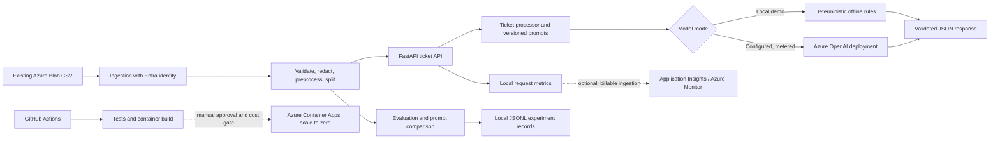

# Architecture

The current demonstration path is local/offline. Azure OpenAI, Application Insights, and Container Apps are optional integration points and were not provisioned. The existing Azure AI Search service is not required for this small classification demo and remains untouched.
