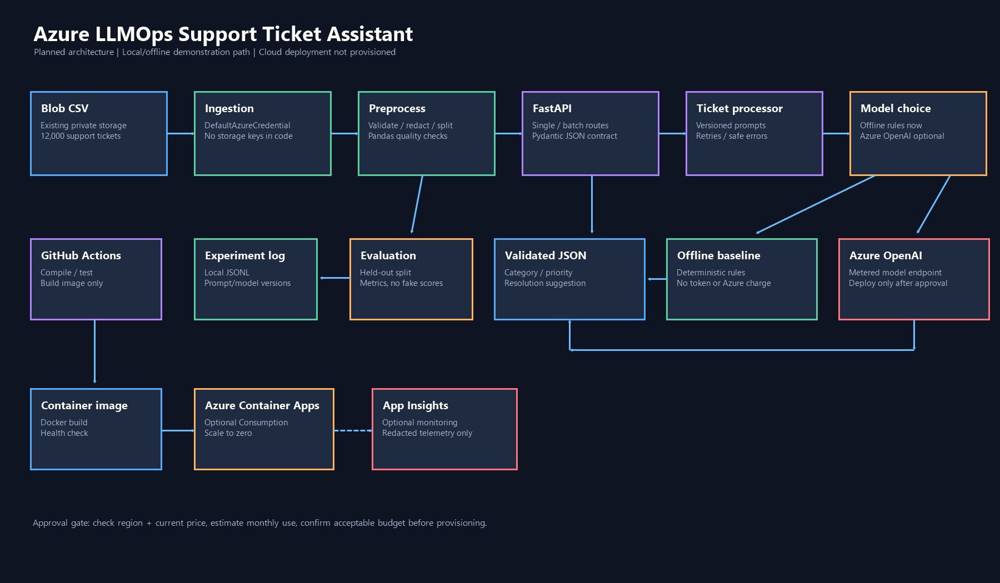

# 02 — Azure LLMOps architecture

Editable Mermaid source: [architecture/azure_llmops_architecture.md](../architecture/azure_llmops_architecture.md).

The present demonstration path is local: authenticated Blob ingestion, pandas validation/redaction/splits, FastAPI, deterministic offline classification, local metrics, and JSONL experiment records. It consumes no model tokens and creates no Azure resources.

Optional cloud path, only after budget and model-region checks: existing Blob → Entra-authenticated ingestion → preprocessing/evaluation → Azure OpenAI → FastAPI in Azure Container Apps Consumption (scale to zero) → Azure Monitor/Application Insights with minimal redacted telemetry. GitHub Actions validates tests and builds an image; deployment is deliberately manual. AML is unnecessary for this 12,000-row demo; local JSONL tracking is sufficient.

The existing Azure AI Search service is not required for classification and is not wired into this first release. It is an existing Standard Search capacity resource and remains untouched.
